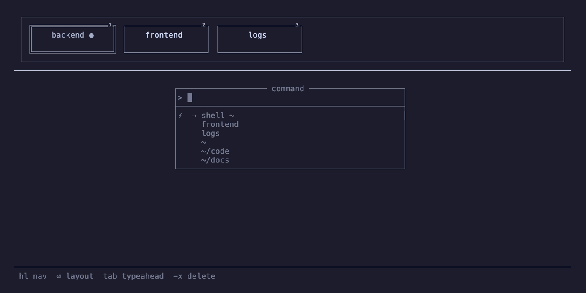
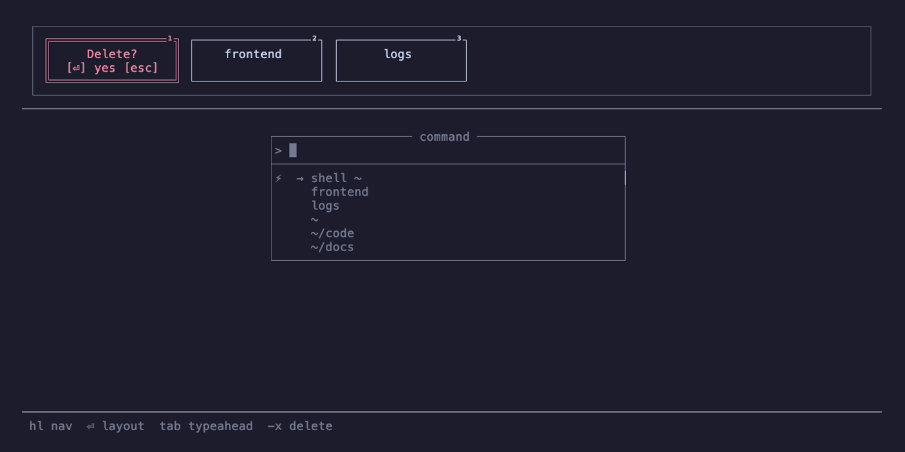
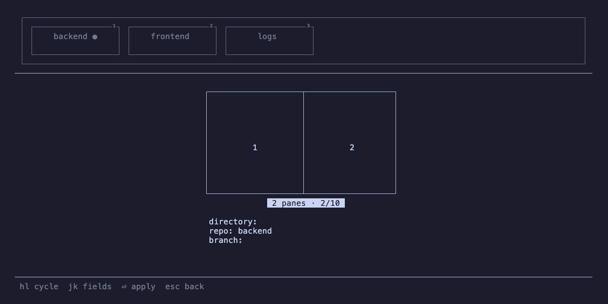

# cmux User Guide

A typeahead-first workspace manager for tmux. This guide walks through every user-visible feature: startup, navigation, pickers, worktrees, and the quick shell.



## Installation

Requirements: `tmux 3.2+`, `bun`.

```bash
bun run install
# or, from source:
bun src/main.ts --install
```

This builds `dist/cmux.js` and writes a wrapper script to `~/.local/bin/cmux`. Make sure `~/.local/bin` is on your `PATH`.

## How it starts

The wrapper script at `~/.local/bin/cmux` runs `eval "$(bun /path/to/cmux.js <(<prefetch>))"`. What happens next depends on whether you are already inside tmux.

- **Outside tmux**, cmux prints `exec tmux new-session -s cmux \; bind -n M-Space display-popup ...`. The wrapper evals it, replacing the shell process with tmux itself. The new session gets an `Alt-Space` binding that opens cmux in an 80% popup. If a `cmux` session already exists, the wrapper attaches to it instead of creating a new one.
- **Inside tmux** (`Alt-Space`), the popup runs cmux directly. Exiting cmux closes the popup.

The `<(...)` process substitution prefetches tmux window data in parallel with Bun's module load. That is why cmux feels instant: by the time the TUI is ready to render, the tmux query has already finished.

## The UI at a glance

```
┌ Carousel (top) ──────────────────────────────────┐
│ ┌─ cmux ──¹┐ ┌─ shellbot ²┐ ┌─ bun ●    ³┐       │
│ │ docs     │ │ main       │ │ main       │       │
│ └──────────┘ └────────────┘ └────────────┘       │
└──────────────────────────────────────────────────┘
──────────────────────────────────────────────────
     ┌ Typeahead OR Layout picker ─────────┐
     │ > search                            │
     │ ⚡ shell                             │
     │ 📦 cmux                              │
     │ 📺 shellbot                          │
     │ 📁 ~/code                            │
     └─────────────────────────────────────┘
──────────────────────────────────────────────────
 type to filter  jk nav  ⏎ select  tab carousel
```

- **Carousel** (top): one box per tmux window, showing `repo / branch`. The active window is marked with `●`. Windows are numbered with superscripts.
- **Middle panel**: switches between the typeahead picker (default) and the layout picker.
- **Hint bar** (bottom): the keys valid in the current focus.

## Focus model

cmux has three focus states. On launch, focus is on the **carousel** — your current tmux window is highlighted and ready to act on. `Tab` switches to the typeahead. Pressing `Enter` on the current carousel window opens the layout picker. `Escape` and `q` back out or quit.

### Typeahead

| Key | Action |
|---|---|
| type | filter items |
| `↑` / `Ctrl-P` | previous item (at top → carousel) |
| `↓` / `Ctrl-N` | next item |
| `Enter` | select current item, or "create" if no match |
| `Tab` | switch to carousel |
| `Backspace` | delete last char |
| `Escape` | quit |

### Carousel (default)

| Key | Action |
|---|---|
| `h` / `l` | move selection left/right |
| `j` / `↓` | switch to typeahead |
| `Enter` / `Space` | if current window → layout picker; else switch to it and exit |
| `1`-`9` | jump to window N (same Enter semantics) |
| `-` / `x` | delete current window (press again to confirm) |
| `Alt-h` / `Alt-l` | swap current window left/right (animated) |
| `Tab` / `Escape` | back to typeahead |
| `q` | quit |

### Layout picker

| Key | Action |
|---|---|
| `h` / `l` | cycle layouts (animated slide) |
| `j` / `k` | move between the layout field and rename fields |
| `Enter` / `Space` | apply layout, exit cmux |
| `Escape` | back to carousel |

## The typeahead picker

The top-level picker combines four source types. Items are grouped by type and, within each group, ordered by how often you have picked them before.

1. **⚡ Commands** — currently just `shell` (see Quick Shell below).
2. **📦 Repos** — git repos you have opened before. The label is the repo name; the hint shows the path, tilde-shortened.
3. **📺 Screens** — open tmux windows, minus the active one and any window whose name matches a known repo (deduped so you don't see the same thing twice).
4. **📁 Directories** — a live search under `~`, `/var`, and `/etc`, up to depth 4 and 20 results.


**Fuzzy-path filtering.** Your input is split on `/` and each segment is matched as a consecutive substring of the label's corresponding segment. Plain substring is the fallback.

**Create on miss.** If nothing matches, pressing `Enter` treats your input as a path. `~` is expanded. If the path is a git repo, cmux opens the branch picker for it; otherwise it opens a new tmux window at that directory.

**Frequency ranking.** Every selection bumps a counter. After a few uses, your most-frequented repos float to the top of their group.

## The carousel

The carousel is always visible. Each box shows `repo / branch` across two lines, truncated to fit. `●` marks the active window, and windows 1–9 are labelled with superscript numbers.

- **Delete.** Press `-` or `x`. The selected box turns red and shows `Delete? [⏎] yes [esc]`. A second `-`, `x`, `Enter`, or `Space` removes it. You cannot delete the last window.

  

- **Reorder.** `Alt-h` and `Alt-l` swap the current window with its neighbour via an 8-frame slide animation, then renumber windows with `tmux move-window -r`.
- **Polling.** The carousel refreshes every 1500ms, so windows created outside cmux appear on their own.

Window names are auto-generated from git state each time cmux starts. You can override the repo portion with aliases in `~/.config/cmux/repos` (see Configuration below).

## The layout picker

Ten fixed layouts, numbered by pane count:

| Panes | Layouts |
|---|---|
| 1 | `full` |
| 2 | `50/50` |
| 3 | `left + right with bottom`, `left with bottom + right`, `left + right stacked`, `left stacked + right` |
| 4 | `both with bottom`, `left min + right stacked`, `left stacked + right min`, `both stacked` |



When you enter the layout picker, cmux auto-selects the layout that best matches your current pane arrangement. Cycling with `h` and `l` previews each option.

**Applying a layout preserves pane content.** cmux does not blow away your panes. It matches existing panes to target slots by position overlap, creates new panes for any uncovered slots, permutes with `tmux swap-pane`, kills any excess panes last, and then applies the tmux layout string. Pane IDs and scrollback survive the transition.

A small top-bias nudges the algorithm to prefer the upper slot when a tall pane is split into a stack, so newly created panes land at the bottom where you expect them.

## The branch picker

Select a repo in the typeahead to drill into its branches and worktrees.

- **Worktrees** (`📂`) are the existing worktrees for this repo. The main worktree is marked with `●`.
- **Branches** (`🌿`) are branches without a worktree.
- Selecting an existing worktree opens a tmux window there.
- Selecting a branch creates a new worktree at `<parent-of-main>/<repo>-<branch>`, branching from `origin/main`. If that fails — the branch already exists, or there is no `origin/main` — cmux falls back to plain `git worktree add <path> <branch>`.
- Typing a new name and pressing `Enter` creates a new branch and worktree with that name, also from `origin/main`.
- **Delete.** Press `Ctrl-X`, `Delete`, or `Backspace` on an empty input. Worktree deletion uses `git worktree remove` with a `--force` fallback and also removes the matching branch. The main worktree cannot be deleted.

## Quick Shell

The `⚡ shell` typeahead item opens a persistent interactive login shell in the working directory of the currently selected carousel window. It is an escape hatch: run anything, then exit back to tmux.

macOS gets an extra trick. If you type a single command and press `Enter`, the output is captured, displayed, and copied to the clipboard via `pbcopy`. You then press any key to close. This makes quick lookups like `git log -1` or `pwd` trivial without leaving your workflow.

Under the hood, cmux spawns `zsh -i` with a temporary `ZDOTDIR` that sources your real zshrc (via `CMUX_REAL_ZDOTDIR`) and installs a `cmux-accept-line` ZLE widget.

## Configuration

### Files

| Path | Purpose |
|---|---|
| `~/.cache/cmux/cmux.sqlite` | frequency, known repos, layout transitions (overridable via `XDG_CACHE_HOME`) |
| `~/.config/cmux/repos` | repo name aliases for carousel labels (overridable via `XDG_CONFIG_HOME`) |

**Repo alias format.** One `long-name=short-name` pair per line. `#` starts a comment. Example:

```
claude-code-internal=cc
very-long-project-name=vlpn
```

### Environment variables

| Variable | Effect |
|---|---|
| `CMUX_DEBUG=1` | writes debug log to `/tmp/cmux.log` |
| `CMUX_BENCHMARK=1` | headless profiling mode; exits after first render |
| `XDG_CACHE_HOME` | overrides DB location |
| `XDG_CONFIG_HOME` | overrides config location |

## Troubleshooting

- **`cmux` does nothing outside tmux.** Make sure `~/.local/bin` is on your `PATH` and that the wrapper script exists. Re-run `bun run install` if in doubt.
- **Carousel shows stale windows.** Wait 1500ms for the next poll, or press any key to force a redraw.
- **Layout apply leaves empty panes.** Normal when the target layout has more slots than existing panes. The new panes inherit the current pane's working directory.
- **Quick shell clipboard copy fails on Linux.** The clipboard copy path is macOS-only today; it shells out to `pbcopy`.
